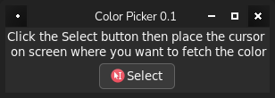
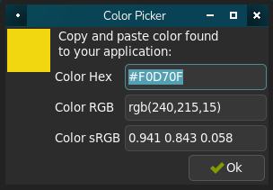

# wly_colpick
A yad script for wlroots compositors to choose a color anywhere on screen

## about

This is a simple bash GUI script that works for `*nix` distributions
that run a wlroots based wayland compositor such as `labwc`, `sway`,
`wayfire`, `hyperland` et al.

## screen shots

     

## build

```
make install
```

That's it!

You can install using `DESTDIR` then roll your own package such that your
package manager can keep track of things. `PREFIX=/usr` is also accepted.

## dependencies

 - yad
 - netpbm (ppmtoxpm)
 - slurp
 - grim
 - bash
 - sed
 - grep
 
#### optional

 - rgb.txt
 
This is actually not needed, but if you have it you are forced to use it!
 
Most distros with a `wlroots` compositor ship with these, except perhaps
`netpbm`.

## usage

In a wayland session this can be invoked from menu, shortcut or CLI. A
yad GUI pops where the user can use the `select` button to fetch the
color.
The cursor should change to a crosshair, then hover over the area where
you want to grab the color and click. A GUI is returned showing the
color in hex, rgb() and decimal formats with a color swatch giving some 
visual feedback (for example: `#F4D131`, `rgb(244,209,49)`, `0.956 0.819 0.192` respectively). 
It does rely on `rgb.txt` when named colors such
as `gray20` occur, which the script tries to find but if it is in a non
standard location you can tell the script in a configuration file at
`~/.config/colpick.conf`
with the contents:

```cfg
rgb_text=/full/path/to/rgb.txt
```

If you delete `rgb.txt` the script will work faster!

## bugs

Report them here in _issues_ or fix them and issue a _pull request_ .

## to do

 - [ ] gettext (NLS)
 - [ ] reduce dependency on bash, sed, grep; ie: more pure shell
